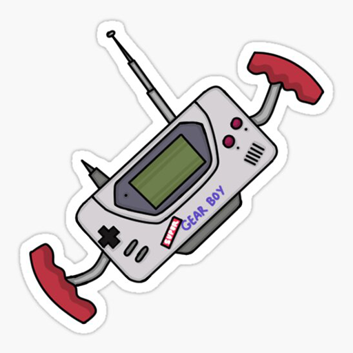
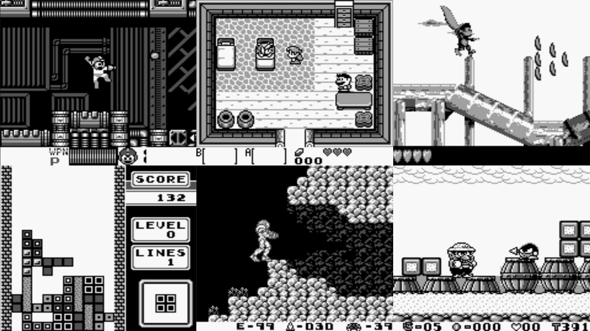
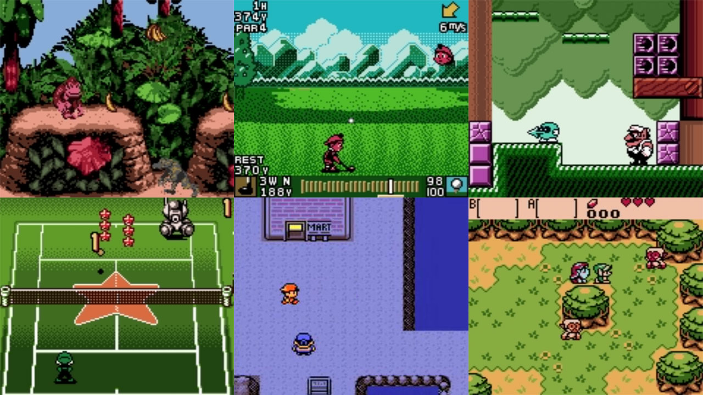

# Nintendo - Game Boy / Color (Gearboy)

### Description

Gearboy is a Nintendo Game Boy / Game Boy Color emulator that runs on iOS, Raspberry Pi, Mac, Windows, Linux and RetroArch.

### License

GPLv3

### Icon

### Fanart

Help make me fanart!

### Screenshots

